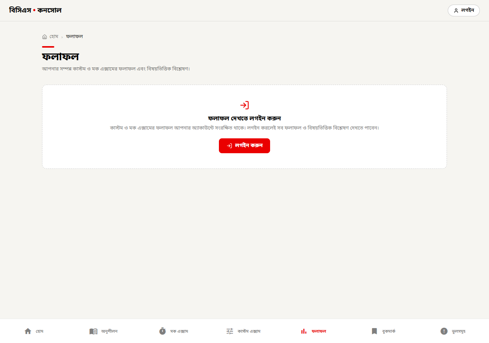
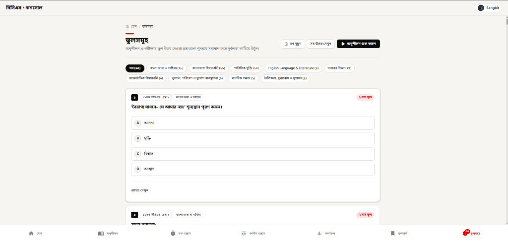

# BCS Console (বিসিএস কনসোল)

  <strong>The modern, syllabus-aware preparation platform for Bangladesh Civil Service (BCS) Preliminary candidates.</strong>

  
  
  
  
  

  <a href="https://bcs-console.vercel.app"><strong>🌐 Launch Web Platform</strong></a> • 
  <a href="https://github.com/SangbitDas/bcs-console/releases/download/v1.1.0/bcs-console-v1.1.0.apk"><strong>📱 Download Android App (APK)</strong></a> • 
  <a href="#-product-features"><strong>✨ Features</strong></a> • 
  <a href="#-data-security--privacy"><strong>🔒 Security & Privacy</strong></a> • 
  <a href="#-legal--fair-use"><strong>⚖️ Legal Terms</strong></a>

  

---

## 🎯 What is BCS Console?

**BCS Console** turns 41 years of past Bangladesh Civil Service preliminary question papers (**10th to 50th BCS**) into an active, customizable examination engine. 

Instead of flipping through static PDFs or memorizing uncurated answer keys, candidates can configure personalized practice sessions, take timed mock tests under authentic BPSC conditions, track lifetime mistake counts, and visualize subject-by-subject strengths and weaknesses.

---

## ✨ Product Features

### 1. Flexible Practice Hub
Practice on your own terms. Select individual exams (from 10th to 50th BCS), isolate any of the 10 fixed syllabus subjects, or build custom question sets with custom BCS ranges.

- **Instant Answer Feedback & Reveal**: View correct answers and comprehensive explanations on demand.
- **Diagram & Image Support**: 766 visual questions accompanied by clear diagrammatic explanations.
- **Session Resumption**: Continue unfinished practice sessions right where you left off.

  

### 2. Timed Mock Examination Simulator
Replicate authentic exam day pressure with standardized BCS Preliminary model tests.

- **Official BPSC Scoring**: Real examination simulation with **+1.00** for correct answers and **−0.50** negative marking for incorrect answers.
- **Exam Formats**: Choose from 200-question Full Syllabus Tests (120 min), Standard 120-question tests, or 60-question Speed Sprints.
- **Interactive Question Palette**: Live countdown timer, answered/unanswered state tracker, and mark-for-review flags.
- **Accidental Navigation Guard**: Multi-layered quit modal and browser back-button interception protect active test sessions from unintended submission.

  

### 3. Results & Performance Analytics (`ফলাফল`)
Track your preparation progress with actionable insights and deep diagnostic metrics.

- **10-Subject Performance Dashboard (সারসংক্ষেপ)**: View aggregated performance metrics over your latest 10 examinations, displaying total attempts, correct count, errors, and net accuracy percentage across all 10 syllabus subjects.
- **Exam History Tracking**: Dedicated tabs for Custom and Mock exams with chronological timestamps, total scores, and duration.
- **Per-Attempt Deep Dive**: Review every attempted question with your submitted answer, the correct key, and comprehensive explanatory notes.
- **Automated Retention**: Cloud database keeps the 50 most recent attempts per exam type.

  

### 4. Mistake Bank (`ভুলসমূহ`)
Turn errors into strengths with an automated revision notebook.

- **Automated Cataloging**: Every question answered incorrectly during practice or mock tests is automatically recorded in the Mistake Bank.
- **Lifetime Mistake Counter**: Badges prominently display how many times you missed each question (e.g. `২ বার ভুল`), helping you identify chronic blind spots.
- **Subject Filtering & One-Tap Practice**: Filter mistakes by subject (e.g. বাংলা, গণিত, বিজ্ঞান) and launch targeted re-practice sessions to master difficult questions.
- **Quick Solution Controls**: Batch reveal or conceal explanations, or clear resolved mistakes when mastered.

  

---

## 📊 Dataset & Syllabus Coverage

Every question in BCS Console is classified under the official 10-subject preliminary syllabus without arbitrary categorization:

| # | Subject (বিষয়) | Syllabus Scope | Verified Questions |
|:---:|:---|:---|:---:|
| 1 | বাংলা ভাষা ও সাহিত্য | Bangla Language & Literature | 1,008 |
| 2 | English Language & Literature | English Grammar, Vocabulary & Literature | 977 |
| 3 | বাংলাদেশ বিষয়াবলি | Bangladesh History, Constitution & Affairs | 831 |
| 4 | আন্তর্জাতিক বিষয়াবলি | Global Affairs, Treaties & Organizations | 747 |
| 5 | গাণিতিক যুক্তি | Mathematical Reasoning & Calculations | 564 |
| 6 | সাধারণ বিজ্ঞান | General Science & Daily Phenomena | 517 |
| 7 | মানসিক দক্ষতা | Mental Ability & Logical Reasoning | 214 |
| 8 | ভূগোল, পরিবেশ ও দুর্যোগ | Geography, Environment & Disaster Management | 201 |
| 9 | কম্পিউটার ও তথ্যপ্রযুক্তি | Computer & Information Technology | 165 |
| 10 | নৈতিকতা, মূল্যবোধ ও সুশাসন | Ethics, Values & Good Governance | 126 |
| **Total** | **41 BCS Papers (10th–50th)** | **Full Preliminary Curriculum** | **5,350** |

> **Dataset Integrity Guarantee:** Exactly 8 defective questions in historical papers with missing or unresolvable answer options are maintained blank as documented facts rather than fabricated guesses. 48 typographical and formatting errors in English literature and language have been rigorously repaired and verified.

---

## 📱 Cross-Platform Availability

BCS Console provides a unified, responsive experience across all screen sizes:

- **Web Application**: Accessible on any browser with instant loading, responsive mobile/desktop layouts, and zero installation needed:  
  👉 **[https://bcs-console.vercel.app](https://bcs-console.vercel.app)**
- **Android App**: Dedicated native APK built with edge-to-edge system styling, gesture pill support, and deep linking:  
  👉 **[Download Android APK (v1.1.0)](https://github.com/SangbitDas/bcs-console/releases/download/v1.1.0/bcs-console-v1.1.0.apk)**

---

## 🔒 Data Security & Privacy Practices

BCS Console adheres to modern industry data security standards:

- **Zero Password Storage**: Authentication is powered exclusively by Google OAuth with PKCE (Proof Key for Code Exchange). We never collect, process, or store passwords.
- **Row-Level Security (RLS)**: The question bank is public read-only. All personal user records (bookmarks, mistake tracking, exam attempts, and session progress) are isolated at the database level by PostgreSQL Row Level Security policies (`auth.uid()`).
- **Privacy-Preserving Guest Mode**: Practice sessions and bookmarks work completely offline and locally without an account. When a candidate signs in, their local progress is securely and non-destructively merged into their cloud account.
- **Strict Network Communication**: All API communication with backend services is encrypted end-to-end via TLS 1.3.

---

## ⚖️ Legal Disclaimer & Fair Use Notice

- **Independent Platform**: BCS Console is an independent, candidate-focused open-source project. It is **not affiliated with, associated with, authorized by, endorsed by, or in any way officially connected** with the Bangladesh Public Service Commission (BPSC) or any government agency.
- **Educational Fair Use**: All question texts, options, diagrams, and historical solutions are compiled and archived strictly for non-commercial educational, analytical, and research purposes under the principles of fair dealing.
- **Software License**: The application source code is licensed under the [GNU General Public License v3.0 (GPL-3.0)](LICENSE).
- **Takedown & Inquiries**: If you are a copyright holder and believe any reference or content should be revised or removed, please open an issue in this repository.

---

  Crafted for BCS candidates with focus, precision, and respect for authentic examination standards.

